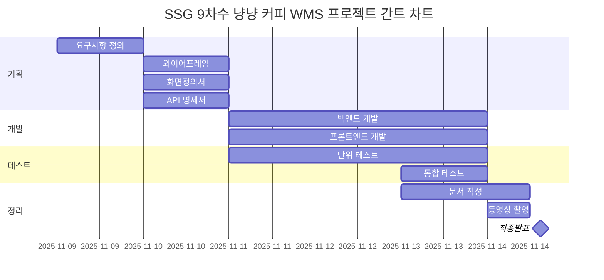

# 🐾 야옹커피 (Yaong Coffee)

> **2차 팀 프로젝트** | Team **야옹야옹(YaongYaong)**  
> **Spring MVC 기반 웹 애플리케이션**  
> Servlet + JSP + Spring Framework를 활용한 MVC 아키텍처 구현 프로젝트

---

## 📖 프로젝트 개요

- **프로젝트명:** 야옹커피 (Yaong Coffee)
- **목표:** 스프링 MVC 패턴을 기반으로 한 웹 커피 주문 및 관리 시스템 구현
- **기술 스택:**
  - Backend: Java 17, Spring Web MVC, JSP, MyBatis
  - Database: MySQL
  - Build Tool: Gradle
  - Server: Apache Tomcat 9
  - IDE: IntelliJ, Visual Studio Code
- **개발 기간:**



---

## 🧩 주요 기능 (예정)

---

## 🧱 프로젝트 구조

```java
src/
├── main/
│   ├── java/
│   │   └── com/ssg/meowcoffee/
│   │       ├── config/                         # 공통 설정 클래스 (예: ModelMapper 설정)
│   │       │   └── ModelMapperConfig.java      # DTO ↔ Entity 매핑 설정
│   │       ├── controller/                     # REST API 및 요청 처리 컨트롤러
│   │       │   ├── exception/                  # 예외 처리 핸들러
│   │       │   │   └── CommonExceptionAdvice.java # 전역 예외 처리 클래스
│   │       │   └── formatter/                  # 커스텀 포맷터 (예: 체크박스, 날짜)
│   │       │       ├── CheckboxFormatter.java
│   │       │       └── LocalDateTimeFormatter.java
│   │       ├── domain/                         # 핵심 도메인 모델 (Entity)
│   │       ├── dto/                            # 데이터 전송 객체 (DTO)
│   │       ├── mapper/                         # MyBatis 매퍼 인터페이스
│   │       │   └── TimeMapper.java             # 시간 관련 매핑 처리
│   │       ├── service/                        # 비즈니스 로직 처리 서비스 클래스
│   │       └── util/                           # 공통 유틸리티 클래스
│   ├── resources/
│   │   ├── log4j2.xml                          # 로깅 설정
│   │   ├── mybatis-config.xml                  # MyBatis 설정
│   │   ├── mappers/                            # MyBatis XML 매퍼
│   │   │   └── TimeMapper.xml
│   │   └── static/                             # 정적 리소스 (HTML, CSS, JS, 이미지 등)
│   │       ├── assets/                         # 프론트엔드 에셋
│   │       │   ├── css/                        # 스타일시트
│   │       │   ├── fonts/                      # 아이콘 및 폰트
│   │       │   ├── img/                        # 이미지 리소스
│   │       │   └── js/                         # 자바스크립트 및 플러그인
│   │       ├── charts/                         # 차트 관련 HTML
│   │       ├── components/                     # UI 컴포넌트 샘플
│   │       ├── forms/                          # 폼 샘플
│   │       ├── maps/                           # 지도 관련 HTML
│   │       ├── tables/                         # 테이블 샘플
│   │       └── *.html                          # 템플릿 및 샘플 페이지
│   └── webapp/
│       ├── index.jsp                           # 기본 진입 JSP
│       └── WEB-INF/
│           ├── spring/                         # Spring 설정 파일
│           │   ├── root-context.xml            # 전역 Bean 설정
│           │   └── servlet-context.xml         # DispatcherServlet 설정
│           └── views/                          # JSP 뷰 파일
│               ├── temp.jsp
│               └── includes/                   # JSP include용 파일
├── test/
│   └── java/
│       └── com/ssg/meowcoffee/
│           └── mapper/
│               └── MapperTests.java            # 매퍼 테스트 클래스

```

---

## 🌿 Git 브랜치 전략 (초안)

| 브랜치 | 용도             |
| ------ | ---------------- |
| `main` | 배포용           |
| `dev`  | 통합 개발 브랜치 |
| 아직   | 미정             |

---

## 🧑‍🤝‍🧑 팀 구성 (Team 야옹야옹)

| 이름       | 담당 파트                                       | 역할 |
| ---------- | ----------------------------------------------- | ---- |
| **박기웅** | 재무 / CS / 대시보드<br>입·출고 / 차량          | 팀장 |
| **김다혜** | 회원 / 로그인 / 보안 / 거래처<br>입·출고 / 차량 | 팀원 |
| **이현빈** | 회원 / 로그인 / 보안 / 거래처                   | 팀원 |
| **고하원** | 재무 / CS / 대시보드                            | 팀원 |
| **전예원** | 창고 / 재고 / 안전점검                          | 팀원 |
| **신건**   | 창고 / 재고 / 안전점검                          | 팀원 |

---

## 🧾 작업 규칙

### 리뷰 정책

- 리뷰어 2명 이상 승인(approve)해야 `merge pull request` 할 수 있음
- 주 담당 개발자는 리뷰어 2명, 부 담당 개발자는 내부 리뷰어 1명으로 구성하여 승인함
  - Git 브랜치 보호 규칙은 1명 이상의 승인시 merge할 수 있도록 하였음.
  - PR 시 아래 표에 맞게 리뷰어 지정 바람.
    - 개인 역량에 따라 리뷰어 선정하였으며 피드백 가능함.

| 개발 기능            | PR 요청자 | 리뷰어1 | 리뷰어2 |
| -------------------- | --------- | ------- | ------- |
| 로그인/회원가입/보안 | 이현빈    | 전예원  | 박기웅  |
| 로그인/회원가입/보안 | 김다혜    | 이현빈  |         |
| 재무/CS/대시보드     | 고하원    | 이현빈  | 전예원  |
| 재무/CS/대시보드     | 박기웅    | 고하원  |         |
| 창고/재고/안전점검   | 전예원    | 박기웅  | 이현빈  |
| 창고/재고/안전점검   | 신건      | 전예원  |         |
| 입/출고/차량         | 박기웅    | 이현빈  | 전예원  |
| 입/출고/차량         | 김다혜    | 박기웅  |         |

### 🔹 커밋 컨벤션

**✅ @commitlint/config-conventional 커밋 컨벤션 적용**

1. 커밋 메시지 기본 구조

```
<type>(optional scope): <subject>
```

- 예시: `feat(login): 로그인 기능 추가`

2. 사용 가능한 `type` 목록

커밋의 목적을 명확히 하기 위해 아래 타입 중 하나를 사용합니다 .

| 타입     | 설명                                      |
| -------- | ----------------------------------------- |
| feat     | 새로운 기능 추가                          |
| fix      | 버그 수정                                 |
| docs     | 문서 수정                                 |
| style    | 코드 포맷팅, 세미콜론 누락 등 비기능 변경 |
| refactor | 코드 리팩토링 (기능 변경 없음)            |
| perf     | 성능 개선                                 |
| test     | 테스트 코드 추가 또는 수정                |
| build    | 빌드 관련 파일 수정                       |
| ci       | CI 설정 관련 변경                         |
| chore    | 기타 변경사항 (예: 패키지 업데이트)       |
| revert   | 이전 커밋 되돌리기                        |

3. `scope` (선택 사항)

- 변경된 기능이나 모듈을 명시합니다.
- 예시: `feat(auth): 로그인 기능 추가`

4. `subject` 작성 규칙

- **간결하고 명확하게 작성** (50자 이내 권장)
- **첫 글자는 소문자**로 시작
- **마침표(.)는 생략**
- 예시: `fix: 로그인 오류 수정`

### 네이밍 컨벤션

#### 메소드 네이밍

🧱 1. DBMapper 계층 (MyBatis Mapper)

| 기능   | 단건               | 다건                 |
| ------ | ------------------ | -------------------- |
| Create | `insertItem()`     | `insertItems()`      |
| Read   | `selectItemById()` | `selectItems()`      |
| Update | `updateItem()`     | `updateItems()`      |
| Delete | `deleteItemById()` | `deleteItemsByIds()` |

> ✅ Prefix(접두사): insert, select, update, delete  
> ✅ Suffix(접미사): ById, ByName, ByCondition 등 명확한 조건 표현
> ✅ 다건 처리는 복수형 사용 (Items, Ids)

🧩 2. Service 계층

| 기능   | 단건             | 다건              |
| ------ | ---------------- | ----------------- |
| Create | `registerItem()` | `registerItems()` |
| Read   | `getItem()`      | `getItemList()`   |
| Update | `modifyItem()`   | `modifyItems()`   |
| Delete | `removeItem()`   | `removeItems()`   |

> ✅ Prefix: register, get, modify, remove  
> ✅ 단건은 단수형, 다건은 List 또는 복수형 사용  
> ✅ 비즈니스 로직 중심의 이름 사용 (getListWithCondition() 등)

🌐 3. Controller 계층

| 기능   | 단건           | 다건             |
| ------ | -------------- | ---------------- |
| Create | `createItem()` | `createItems()`  |
| Read   | `readItem()`   | `readItemList()` |
| Update | `updateItem()` | `updateItems()`  |
| Delete | `deleteItem()` | `deleteItems()`  |

> ✅ RESTful URL에 맞춰 @PostMapping, @GetMapping, @PutMapping, @DeleteMapping 사용
> ✅ 메서드 이름은 HTTP 동작과 맞춰 create, read, update, delete  
> ✅ URL 예시:
>
> - `POST /items` → `createItem()`
> - `GET /items/{id}` → `readItem()`
> - `GET /items` → `readItemList()`
> - `PUT /items/{id}` → `updateItem()`
> - `DELETE /items/{id}` → `deleteItem()`

#### 🧭변수 네이밍

- **CamelCase** 사용 (`itemCode`, `stockQty`)
- **축약은 의미가 명확할 때만 사용** (예: `uid`, `qty`, `dt`)
- **혼동되는 약어는 피하기** (예: `cd`는 `code`인지 `createdDate`인지 모호할 수 있음)
- **약어는 명확하고 일관되게** 사용 (`qty` : 물리적 수량(양), `amt` : 금액, `cd` : 코드, `dt` : 일자, `id` : 키값, `nm` : 이름, `yn` : 여부 , `cnt` : 개수, 건수, 횟수)
- **불린형 변수는** `is`**,** `has`**,** `can` **등으로 시작** (`isActive`, `hasStock`)
- **List/Map 등 컬렉션은 접미어로 명시** (`itemList`, `stockMap`)
- **단수/복수 구분** 명확히 (`item` vs `items`, `qty` vs `qtyList`)
