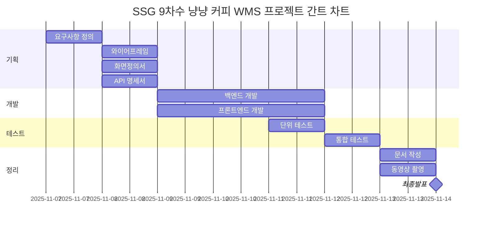

# 🐾 야옹커피 (Yaong Coffee)

> **2차 팀 프로젝트** | Team **야옹야옹(YaongYaong)**  
> **Spring MVC 기반 웹 애플리케이션**  
> Servlet + JSP + Spring Framework를 활용한 MVC 아키텍처 구현 프로젝트

---

## 📖 프로젝트 개요

- **프로젝트명:** 야옹커피 (Yaong Coffee)
- **목표:** 스프링 MVC 패턴을 기반으로 한 웹 커피 주문 및 관리 시스템 구현
- **기술 스택:**
  - Backend: Java 17, Spring Web MVC, JSP, MyBatis
  - Database: MySQL
  - Build Tool: Gradle
  - Server: Apache Tomcat 9
  - IDE: IntelliJ, Visual Studio Code
- **개발 기간:**



---

## 🧩 주요 기능 (예정)

---

## 🧱 프로젝트 구조 (예정)

---

## 🌿 Git 브랜치 전략 (초안)

| 브랜치 | 용도             |
| ------ | ---------------- |
| `main` | 배포용           |
| `dev`  | 통합 개발 브랜치 |
| 아직   | 미정             |

---

## 🧑‍🤝‍🧑 팀 구성 (Team 야옹야옹)

| 이름       | 담당 파트                                       | 역할 |
| ---------- | ----------------------------------------------- | ---- |
| **박기웅** | 재무 / CS / 대시보드<br>입·출고 / 차량          | 팀장 |
| **김다혜** | 회원 / 로그인 / 보안 / 거래처<br>입·출고 / 차량 | 팀원 |
| **이현빈** | 회원 / 로그인 / 보안 / 거래처                   | 팀원 |
| **고하원** | 재무 / CS / 대시보드                            | 팀원 |
| **전예원** | 창고 / 재고 / 안전점검                          | 팀원 |
| **신건**   | 창고 / 재고 / 안전점검                          | 팀원 |

---

## 🧾 작업 규칙

### 리뷰 정책

- 리뷰어 2명 이상 승인(approve)해야 `merge pull request` 할 수 있음
- 주 담당 개발자는 리뷰어 2명, 부 담당 개발자는 내부 리뷰어 1명으로 구성하여 승인함
  - Git 브랜치 보호 규칙은 1명 이상의 승인시 merge할 수 있도록 하였음.
  - PR 시 아래 표에 맞게 리뷰어 지정 바람.
    - 개인 역량에 따라 리뷰어 선정하였으며 피드백 가능함.

| 개발 기능            | PR 요청자 | 리뷰어1 | 리뷰어2 |
| -------------------- | --------- | ------- | ------- |
| 로그인/회원가입/보안 | 이현빈    | 전예원  | 박기웅  |
| 로그인/회원가입/보안 | 김다혜    | 이현빈  |         |
| 재무/CS/대시보드     | 고하원    | 이현빈  | 전예원  |
| 재무/CS/대시보드     | 박기웅    | 고하원  |         |
| 창고/재고/안전점검   | 전예원    | 박기웅  | 이현빈  |
| 창고/재고/안전점검   | 신건      | 전예원  |         |
| 입/출고/차량         | 박기웅    | 이현빈  | 전예원  |
| 입/출고/차량         | 김다혜    | 박기웅  |         |

### 🔹 커밋 컨벤션

**✅ @commitlint/config-conventional 커밋 컨벤션 적용**

1. 커밋 메시지 기본 구조

```
<type>(optional scope): <subject>
```

- 예시: `feat(login): 로그인 기능 추가`

2. 사용 가능한 `type` 목록

커밋의 목적을 명확히 하기 위해 아래 타입 중 하나를 사용합니다 .

| 타입     | 설명                                      |
| -------- | ----------------------------------------- |
| feat     | 새로운 기능 추가                          |
| fix      | 버그 수정                                 |
| docs     | 문서 수정                                 |
| style    | 코드 포맷팅, 세미콜론 누락 등 비기능 변경 |
| refactor | 코드 리팩토링 (기능 변경 없음)            |
| perf     | 성능 개선                                 |
| test     | 테스트 코드 추가 또는 수정                |
| build    | 빌드 관련 파일 수정                       |
| ci       | CI 설정 관련 변경                         |
| chore    | 기타 변경사항 (예: 패키지 업데이트)       |
| revert   | 이전 커밋 되돌리기                        |

3. `scope` (선택 사항)

- 변경된 기능이나 모듈을 명시합니다.
- 예시: `feat(auth): 로그인 기능 추가`

4. `subject` 작성 규칙

- **간결하고 명확하게 작성** (50자 이내 권장)
- **첫 글자는 소문자**로 시작
- **마침표(.)는 생략**
- 예시: `fix: 로그인 오류 수정`
