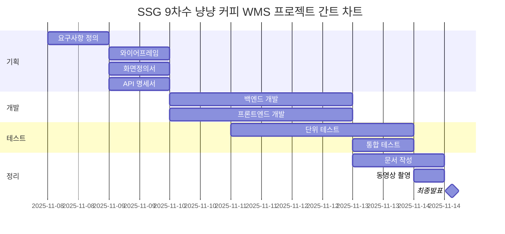
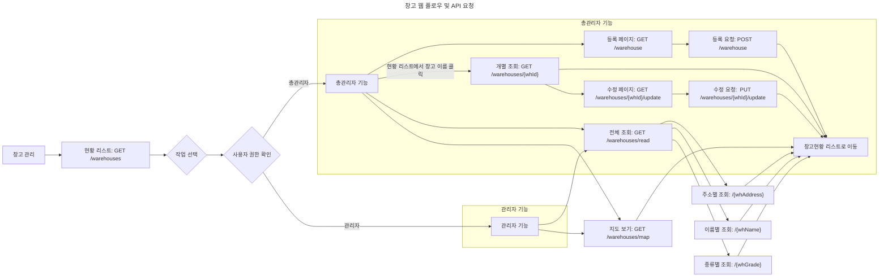
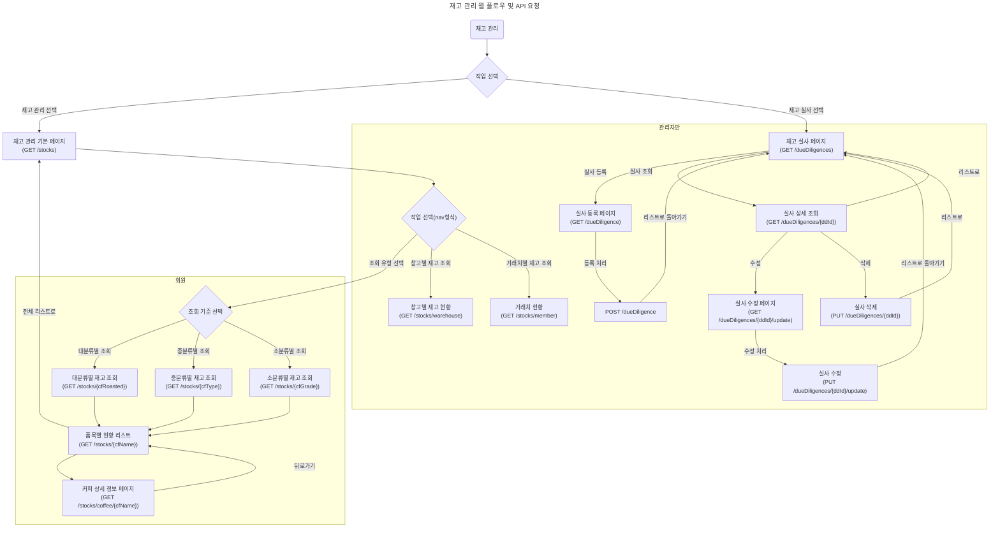

# 🐾 야옹커피 (Yaong Coffee)

> **2차 팀 프로젝트** | Team **야옹야옹(YaongYaong)**  
> **Spring MVC 기반 웹 애플리케이션**  
> SSR(Servlet + JSP) + Vanilla JS + Spring Framework(Spring Security 적용)를 활용한 웹 MVC 아키텍처 구현 프로젝트

---

## 📖 프로젝트 개요

- **프로젝트 명:** 야옹커피 (Meow Coffee)
- **프로젝트 목표:** 스프링 MVC 패턴을 기반으로 한 회원사(화주)의 상품 입고 요청부터 창고 내 적치, 재고 관리, 출고 지시에 이르기까지 창고 운영의 전 과정을 웹 애플리케이션으로 구현

### 기술 스택 (Technology Stack)

| 구분            | 기술                                                   | 상세 내용                                                          |
| --------------- | ------------------------------------------------------ | ------------------------------------------------------------------ |
| **Backend**     | Java 11, Spring Framework 5.3.27, Lombok, Jackson      | 안정적인 비즈니스 로직 처리를 위한 Spring Framework 기반 서버 구축 |
| **Database**    | MySQL 8.0.22                                           | 관계형 데이터베이스 시스템                                         |
| **Data Access** | MyBatis 3.5.7, HikariCP                                | SQL 중심의 개발 및 높은 성능의 DB Connection Pool 사용             |
| **Frontend**    | JSP, JavaScript (ES6), JSTL, AJAX (Axios)              | 서버사이드 렌더링 및 동적 UI 구현                                  |
| **UI/UX**       | Bootstrap 5, jQuery, FullCalendar, Flatpickr, Chart.js | 반응형 웹 디자인 및 인터랙티브한 데이터 시각화                     |
| **Server**      | Apache Tomcat 9.0.11                                   | WAS(Web Application Server)                                        |
| **API**         | Daum 도로명 주소, Kakao 지도                           | 창고 등록 및 조회 시 활용                                          |
| **Build Tool**  | Gradle                                                 | 의존성 관리 및 프로젝트 빌드 자동화                                |

### **개발 기간**

총 7일 (2025-11-08 ~ 2025-11-14)



---

## 🧩 주요 기능

본 프로젝트는 크게 로그인, 회원가입, 입고, 출고, 창고, 재고, 재무, 대시보드 기능으로 구성되어 있으며,
아래는 예시로 입고 관리 파트의 주요 기능입니다.

| 구분              | 주요 기능                 | 상세 설명                                                                                                                                                                                                                                                                                                                                                                                                                                                                                          |
| ----------------- | ------------------------- | -------------------------------------------------------------------------------------------------------------------------------------------------------------------------------------------------------------------------------------------------------------------------------------------------------------------------------------------------------------------------------------------------------------------------------------------------------------------------------------------------- |
| **입고 관리**     | 회원사 입고 요청          | 회원사가 입고할 상품, 수량, 희망 입고일을 지정하여 요청하고 임시 저장하는 기능을 제공합니다.                                                                                                                                                                                                                                                                                                                                                                                                       |
|                   | **관리자 동적 입고 처리** | 관리자는 시각화된 데이터를 바탕으로 입고 요청을 처리합니다.<br> • **창고 부하 시각화**: FullCalendar와 연동하여 일별/창고별 예상 부하(처리량, 인력, 장비)를 '안전', '경고', '위험' 상태로 표시합니다.<br> • **최적 보관 위치 추천**: 선택된 날짜와 입고 수량을 기준으로, 공간 효율성 및 작업 안정성을 고려한 최적의 보관 위치(Location)를 시스템이 추천합니다.<br> • **유연한 날짜 재지정**: Flatpickr UI를 통해 관리자가 실시간으로 부하 정보를 확인하며 최적의 입고 예정일을 지정할 수 있습니다. |
|                   | 입고 지시서 생성          | '승인완료'된 건에 대해 현장 작업자를 위한 상세 입고 지시서를 생성하고, PDF로 출력하거나 공유할 수 있습니다.                                                                                                                                                                                                                                                                                                                                                                                        |
|                   | 검수 및 실물 입고 처리    | 현장에서 지시서 기반의 검수가 완료되면, 관리자는 시스템에서 '검수 시작' 및 '실물 입고 완료' 처리를 통해 재고를 확정합니다.                                                                                                                                                                                                                                                                                                                                                                         |
|                   | QR 코드 연동              | '입고완료' 처리 시, 해당 재고(파렛트 단위)의 고유 QR 코드가 생성됩니다. QR 코드 스캔 시 해당 재고의 상세 정보 페이지로 이동하여 실시간 재고 추적을 지원합니다.                                                                                                                                                                                                                                                                                                                                     |
| **대시보드/통계** | 주요 지표 시각화          | (대시보드 담당 구현) 월별/일별 입출고량, 품목별 입출고 순위, 평균 입고/출고 리드타임 등 핵심 성과 지표(KPI)를 차트로 제공합니다.                                                                                                                                                                                                                                                                                                                                                                   |

---

## 🧱 프로젝트 구조

```java
src/
├── main/
│   ├── java/
│   │   └── com/ssg/meowcoffee/
│   │       ├── config/                         # 공통 설정 클래스 (예: ModelMapper 설정)
│   │       │   └── ModelMapperConfig.java      # DTO ↔ Entity 매핑 설정
│   │       ├── controller/                     # REST API 및 요청 처리 컨트롤러
│   │       │   ├── exception/                  # 예외 처리 핸들러
│   │       │   │   └── CommonExceptionAdvice.java # 전역 예외 처리 클래스
│   │       │   └── formatter/                  # 커스텀 포맷터 (예: 체크박스, 날짜)
│   │       │       ├── CheckboxFormatter.java
│   │       │       └── LocalDateTimeFormatter.java
│   │       ├── domain/                         # 핵심 도메인 모델 (Entity)
│   │       ├── dto/                            # 데이터 전송 객체 (DTO)
│   │       ├── mapper/                         # MyBatis 매퍼 인터페이스
│   │       │   └── TimeMapper.java             # 시간 관련 매핑 처리
│   │       ├── service/                        # 비즈니스 로직 처리 서비스 클래스
│   │       └── util/                           # 공통 유틸리티 클래스
│   ├── resources/
│   │   ├── log4j2.xml                          # 로깅 설정
│   │   ├── mybatis-config.xml                  # MyBatis 설정
│   │   ├── mappers/                            # MyBatis XML 매퍼
│   │   │   └── TimeMapper.xml
│   │   └── static/                             # 정적 리소스 (HTML, CSS, JS, 이미지 등)
│   │       ├── assets/                         # 프론트엔드 에셋
│   │       │   ├── css/                        # 스타일시트
│   │       │   ├── fonts/                      # 아이콘 및 폰트
│   │       │   ├── img/                        # 이미지 리소스
│   │       │   └── js/                         # 자바스크립트 및 플러그인
│   │       ├── charts/                         # 차트 관련 HTML
│   │       ├── components/                     # UI 컴포넌트 샘플
│   │       ├── forms/                          # 폼 샘플
│   │       ├── maps/                           # 지도 관련 HTML
│   │       ├── tables/                         # 테이블 샘플
│   │       └── *.html                          # 템플릿 및 샘플 페이지
│   └── webapp/
│       ├── index.jsp                           # 기본 진입 JSP
│       └── WEB-INF/
│           ├── spring/                         # Spring 설정 파일
│           │   ├── root-context.xml            # 전역 Bean 설정
│           │   └── servlet-context.xml         # DispatcherServlet 설정
│           └── views/                          # JSP 뷰 파일
│               ├── temp.jsp
│               └── includes/                   # JSP include용 파일
├── test/
│   └── java/
│       └── com/ssg/meowcoffee/
│           └── mapper/
│               └── MapperTests.java            # 매퍼 테스트 클래스

```

---

## 🌿 Git 브랜치 전략 : Git-Flow 채택

| 브랜치    | 용도          |
|--------|-------------|
| `main` | 배포용         |
| `dev`  | 통합 개발 브랜치   |
| `feat`  | 각 기능 개발 브랜치 |

---

## 🧑‍🤝‍🧑 팀 구성 맟 역할

> 각 담당 파트별 백엔드 및 프론트 전체 구현

| 이름       | 담당 파트                                | 역할 |
| ---------- |--------------------------------------| ---- |
| **박기웅** | 입고 관리                                | 팀장 |
| **김다혜** | 회원 / 로그인 / 출고 / 차량                   | 팀원 |
| **이현빈** | 회원 / 로그인 / 보안(Spring Security) / 거래처 | 팀원 |
| **고하원** | 재무 관리 / 대시보드                         | 팀원 |
| **전예원** | 창고 / 재고 관리                           | 팀원 |
| **신건**   | 창고 / 문서 관리                           | 팀원 |

---

## 🧾 작업 규칙

### 리뷰 정책

- 리뷰어 2명 이상 승인(approve)해야 `merge pull request` 할 수 있음
- 주 담당 개발자는 리뷰어 2명, 부 담당 개발자는 내부 리뷰어 1명으로 구성하여 승인함
  - Git 브랜치 보호 규칙은 1명 이상의 승인시 merge할 수 있도록 하였음.
  - PR 시 아래 표에 맞게 리뷰어 지정
    - 개인 역량에 따라 리뷰어 선정

| 개발 기능            | PR 요청자 | 리뷰어1 | 리뷰어2 |
| -------------------- | --------- | ------- | ------- |
| 로그인/회원가입/보안 | 이현빈    | 전예원  | 박기웅  |
| 로그인/회원가입/보안 | 김다혜    | 이현빈  |         |
| 재무/CS/대시보드     | 고하원    | 이현빈  | 전예원  |
| 재무/CS/대시보드     | 박기웅    | 고하원  |         |
| 창고/재고/안전점검   | 전예원    | 박기웅  | 이현빈  |
| 창고/재고/안전점검   | 신건      | 전예원  |         |
| 입/출고/차량         | 박기웅    | 이현빈  | 전예원  |
| 입/출고/차량         | 김다혜    | 박기웅  |         |

### 🔹 커밋 컨벤션

**✅ @commitlint/config-conventional 커밋 컨벤션 적용**

1. 커밋 메시지 기본 구조

```
<type>(optional scope): <subject>
```

- 예시: `feat(login): 로그인 기능 추가`

2. 사용 가능한 `type` 목록

커밋의 목적을 명확히 하기 위해 아래 타입 중 하나를 사용합니다 .

| 타입     | 설명                                      |
| -------- | ----------------------------------------- |
| feat     | 새로운 기능 추가                          |
| fix      | 버그 수정                                 |
| docs     | 문서 수정                                 |
| style    | 코드 포맷팅, 세미콜론 누락 등 비기능 변경 |
| refactor | 코드 리팩토링 (기능 변경 없음)            |
| perf     | 성능 개선                                 |
| test     | 테스트 코드 추가 또는 수정                |
| build    | 빌드 관련 파일 수정                       |
| ci       | CI 설정 관련 변경                         |
| chore    | 기타 변경사항 (예: 패키지 업데이트)       |
| revert   | 이전 커밋 되돌리기                        |

3. `scope` (선택 사항)

- 변경된 기능이나 모듈을 명시합니다.
- 예시: `feat(auth): 로그인 기능 추가`

4. `subject` 작성 규칙

- **간결하고 명확하게 작성** (50자 이내 권장)
- **첫 글자는 소문자**로 시작
- **마침표(.)는 생략**
- 예시: `fix: 로그인 오류 수정`

### 네이밍 컨벤션

#### 메소드 네이밍

🧱 1. DBMapper 계층 (MyBatis Mapper)

| 기능   | 단건               | 다건                 |
| ------ | ------------------ | -------------------- |
| Create | `insertItem()`     | `insertItems()`      |
| Read   | `selectItemById()` | `selectItems()`      |
| Update | `updateItem()`     | `updateItems()`      |
| Delete | `deleteItemById()` | `deleteItemsByIds()` |

> ✅ Prefix(접두사): insert, select, update, delete  
> ✅ Suffix(접미사): ById, ByName, ByCondition 등 명확한 조건 표현
> ✅ 다건 처리는 복수형 사용 (Items, Ids)

🧩 2. Service 계층

| 기능   | 단건             | 다건              |
| ------ | ---------------- | ----------------- |
| Create | `registerItem()` | `registerItems()` |
| Read   | `getItem()`      | `getItemList()`   |
| Update | `modifyItem()`   | `modifyItems()`   |
| Delete | `removeItem()`   | `removeItems()`   |

> ✅ Prefix: register, get, modify, remove  
> ✅ 단건은 단수형, 다건은 List 또는 복수형 사용  
> ✅ 비즈니스 로직 중심의 이름 사용 (getListWithCondition() 등)

🌐 3. Controller 계층

| 기능   | 단건           | 다건             |
| ------ | -------------- | ---------------- |
| Create | `createItem()` | `createItems()`  |
| Read   | `readItem()`   | `readItemList()` |
| Update | `updateItem()` | `updateItems()`  |
| Delete | `deleteItem()` | `deleteItems()`  |

> ✅ RESTful URL에 맞춰 @PostMapping, @GetMapping, @PutMapping, @DeleteMapping 사용
> ✅ 메서드 이름은 HTTP 동작과 맞춰 create, read, update, delete  
> ✅ URL 예시:
>
> - `POST /items` → `createItem()`
> - `GET /items/{id}` → `readItem()`
> - `GET /items` → `readItemList()`
> - `PUT /items/{id}` → `updateItem()`
> - `DELETE /items/{id}` → `deleteItem()`

#### 🧭변수 네이밍

- **CamelCase** 사용 (`itemCode`, `stockQty`)
- **축약은 의미가 명확할 때만 사용** (예: `uid`, `qty`, `dt`)
- **혼동되는 약어는 피하기** (예: `cd`는 `code`인지 `createdDate`인지 모호할 수 있음)
- **약어는 명확하고 일관되게** 사용 (`qty` : 물리적 수량(양), `amt` : 금액, `cd` : 코드, `dt` : 일자, `id` : 키값, `nm` : 이름, `yn` : 여부 , `cnt` : 개수, 건수, 횟수)
- **불린형 변수는** `is`**,** `has`**,** `can` **등으로 시작** (`isActive`, `hasStock`)
- **List/Map 등 컬렉션은 접미어로 명시** (`itemList`, `stockMap`)
- **단수/복수 구분** 명확히 (`item` vs `items`, `qty` vs `qtyList`)

## ERD


## 화면 설계 및 와이어 프레임

### 회원 관리


.drawio.png>)
.drawio.png>)
.drawio.png>)

### 입고 관리


### 출고 관리


### 창고 관리



### 재고 관리



### 재무 관리

```mermaid
flowchart TD
  %% Finance Main
  Home["재무 메인<br/>/finance"] --> Charts["지출·매출 차트"]

  %% Expense screens
  subgraph Expense["Expense"]
    EX1["지출내역 조회<br/>GET /finance/expenses"]
    EX2["지출 상세<br/>GET /finance/expenses/&#123;id&#125;"]
    EX3["지출 생성<br/>POST /finance/expenses"]
    EX4["지출 확정<br/>POST /finance/expenses/&#123;id&#125;&#58;post"]
    EX5["지출 수정<br/>PUT /finance/expenses"]
    EX6["지출 삭제(soft)<br/>PUT /finance/expenses/&#123;id&#125;&#58;delete"]
  end

  %% Invoices screens
  subgraph Invoices["Invoices"]
    IV1["정산서 조회<br/>GET /finance/invoices"]
    IV2["정산서 상세<br/>GET /finance/invoices/&#123;id&#125;"]
    IV3["정산 자동 생성<br/>POST /finance/invoices&#58;generate"]
    IV4["정산서 발행<br/>POST /finance/invoices/&#123;id&#125;&#58;issue"]
    IV5["정산서 취소<br/>POST /finance/invoices/&#123;id&#125;&#58;cancel"]
    IV6["입금 반영<br/>POST /finance/invoices/&#123;id&#125;&#58;paid"]
  end

  %% Revenue screens
  subgraph Revenue["Revenue"]
    RV1["매출합계 조회<br/>GET /finance/revenue"]

  end

  %% Main links
  Charts --- Expense
  Charts --- Invoices
  Charts --- Revenue

  %% Expense flow
  EX1 --> EX2
  EX1 --> EX3
  EX2 --> EX4
  EX2 --> EX5
  EX2 --> EX6

  %% Invoice flow
  IV1 --> IV2
  IV1 --> IV3
  IV2 --> IV4
  IV2 --> IV5
  IV2 --> IV6
```



## 프로젝트 구현 기능

### 입고 관리 파트

[](https://www.youtube.com/watch?v=BBk4V9J8obs&t=1s)

1. 입고 요청 및 목록 조회: 회원사가 입고를 요청하고, 회원/관리자가 조건별로 목록을 필터링/정렬
2. 동적 입고 처리 과정 (핵심 기능):

- 관리자가 FullCalendar에서 특정 날짜를 클릭하면 우측에 해당 날짜의 부하 정보와 할당 가능 위치가 실시간으로 업데이트
- 관리자가 최종 처리 섹션의 데이트 피커(flatpickr)로 날짜를 변경할 때마다 위치 추천 드롭다운이 함께 변경됨

3. 입고 지시서 및 QR 코드 생성: '입고 지시서' 버튼을 눌러 PDF 미리보기/출력 화면으로 이동, 'QR 코드 보기' 버튼을 눌러 모달에 QR 코드가 뜨고, 클릭하면 재고화된 정보가 새 화면으로 뜸.
