# 재무 관리 웹 API 요청 플로우 차트

```mermaid
flowchart TD
  %% Finance Main
  Home["재무 메인<br/>/finance"] --> Charts["지출·매출 차트"]

  %% Expense screens
  subgraph Expense["Expense"]
    EX1["지출내역 조회<br/>GET /finance/expenses"]
    EX2["지출 상세<br/>GET /finance/expenses/&#123;id&#125;"]
    EX3["지출 생성<br/>POST /finance/expenses"]
    EX4["지출 확정<br/>POST /finance/expenses/&#123;id&#125;&#58;post"]
    EX5["지출 수정<br/>PUT /finance/expenses"]
    EX6["지출 삭제(soft)<br/>PUT /finance/expenses/&#123;id&#125;&#58;delete"]
  end

  %% Invoices screens
  subgraph Invoices["Invoices"]
    IV1["정산서 조회<br/>GET /finance/invoices"]
    IV2["정산서 상세<br/>GET /finance/invoices/&#123;id&#125;"]
    IV3["정산 자동 생성<br/>POST /finance/invoices&#58;generate"]
    IV4["정산서 발행<br/>POST /finance/invoices/&#123;id&#125;&#58;issue"]
    IV5["정산서 취소<br/>POST /finance/invoices/&#123;id&#125;&#58;cancel"]
    IV6["입금 반영<br/>POST /finance/invoices/&#123;id&#125;&#58;paid"]
  end

  %% Revenue screens
  subgraph Revenue["Revenue"]
    RV1["매출합계 조회<br/>GET /finance/revenue"]

  end

  %% Main links
  Charts --- Expense
  Charts --- Invoices
  Charts --- Revenue

  %% Expense flow
  EX1 --> EX2
  EX1 --> EX3
  EX2 --> EX4
  EX2 --> EX5
  EX2 --> EX6

  %% Invoice flow
  IV1 --> IV2
  IV1 --> IV3
  IV2 --> IV4
  IV2 --> IV5
  IV2 --> IV6
```

## API 요청 설명

### 1. 재무 차트

- (GET /finance) : 총관리자는 모든 창고들의 지출과 정산, 매출 현황을 조회할 수 있는 차트를 조회할 수 있습니다. 창고관리자는 본인이 소속한 창고의 데이터만을 조회할 수 있으며, 지출과 매출만 확인 가능합니다.

### 2. 지출

- (GET /finance/expenses) : 날짜, 창고, 상태 별로 볼 수 있는 지출 내역 목록을 출력합니다.
- (POST /finance/expenses) : 입고, 출고, 검수와 관련된 지출은 트리거를 사용하여 생성되므로, 생성은 관리비(전기세, 수도세) 등 기타 지출을 생성합니다.
- (GET /finance/expenses/{expenseId}) : 해당하는 지출 내역을 상세하게 볼 수 있도록 해당 지출 내역의 지출 리스트를 출력합니다.
- (POST /finance/expenses/{expenseId}):post : 해당 지출 내역을 검토 후 상태를 확정 지을 수 있는 기능을 제공합니다. 확정 시, 수정 또는 삭제가 불가능합니다.
- (PUT /finance/expenses/{expenseId}) : 해당 지출 내역을 수정하는 기능을 제공합니다.
- (PUT /finance/expenses/{expenseId}):delete : 해당 지출 내역을 삭제하는 기능을 제공합니다.

### 3. 청구

- (GET /finance/invoices) : 날짜, 창고, 상태 별로 볼 수 있는 청구 내역 목록을 출력합니다.
- (GET /finance/invoices/{invoiceId}) : 해당하는 청구 내역을 상세하게 볼 수 있도록 해당 청구 내역의 청구 리스트를 출력합니다.
- (POST /finance/invoices:generate) : 기간/화주 별 기준으로 자동으로 집계하여 청구서를 생성합니다. 출력 또한 가능합니다.
- (GET /finance/invoices/{invoiceId}:issue) : 청구 내역의 상태를 "청구완료"로 변경합니다. 청구서를 거래처에 제출 시 사용하는 기능입니다.
- (GET /finance/invoices/{invoiceId}:cancel) : 청구 내역의 상태를 "취소"로 변경합니다.
- (GET /finance/invoices/{invoiceId}:paid) : 청구 내역의 상태를 "입금완료"로 변경합니다. 입금 완료 확인 시 사용하는 기능입니다.

### 4. 매출

- (GET /finance/revenue) : 이번 달 매출과, 전월 대비 수익률 등 여러 차트를 제공하고, 창고별 매출 랭킹 표를 제공합니다.
