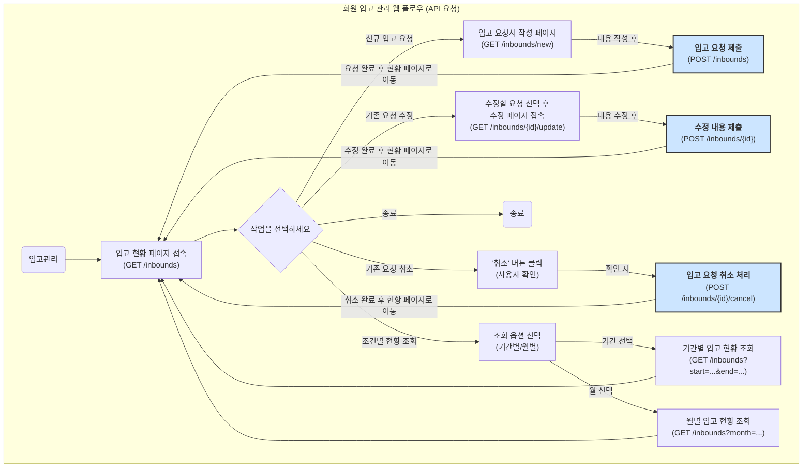
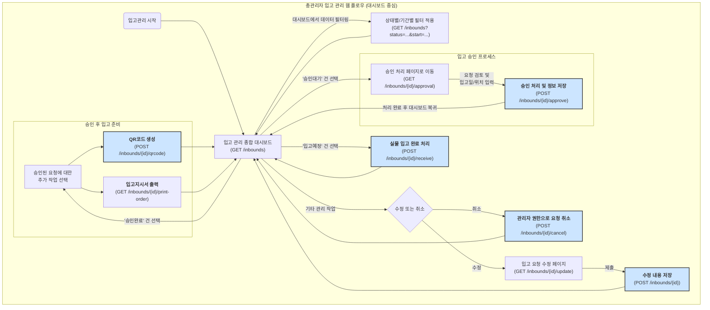

## 회원 입고 관리 웹 API 요청 플로우 차트

API 요청 설명

1. 입고 현황 조회

- (GET /inbounds): 자신이 요청한 모든 입고 건의 전체 목록을 서버로부터 받아와 화면에 표시합니다.
- (GET /inbounds?start=...&end=... 또는 ?month=...): 시작일/종료일 또는 특정 월을 기준으로 자신이 요청한 입고 현황을 기간별로 필터링하여 조회합니다.

2. 신규 입고 요청

- (GET /inbounds/new): 새로운 입고 요청서를 작성할 수 있는 입력 양식(form) 페이지를 불러옵니다.
- (POST /inbounds): 작성한 입고 요청서의 데이터를 서버로 전송하여 새로운 입고 건을 생성합니다.

3. 기존 입고 요청 관리

- (GET /inbounds/{id}/update): '승인대기' 상태인 특정 입고 요청({id})의 내용을 수정하기 위해, 기존 데이터가 채워진 수정 페이지를 불러옵니다.
- (POST /inbounds/{id}): 수정 페이지에서 변경한 내용을 서버로 전송하여 데이터를 업데이트합니다.
- (POST /inbounds/{id}/cancel): '승인대기' 상태인 특정 입고 요청({id})을 **철회(취소)**하기 위해 서버에 요청을 보냅니다.

## 관리자 입고 관리 웹 API 요청 플로우 차트

1. 입고 현황 조회 (목록 및 필터링)ß

- (GET /inbounds): 모든 입고 요청 목록(상태 무관)을 조회하여 관리자 대시보드에 표시합니다. 관리자가 전체 현황을 파악하는 기본 API입니다.
- (GET /inbounds?status=...&start=...&end=...): 상태(pending, approved, received 등), 시작일, 종료일 등 다양한 쿼리 파라미터를 사용하여 입고 목록을 필터링하여 조회합니다. 예를 들어, 처리해야 할 승인대기 건만 보려면 ?status=pending을 사용합니다.

2. 입고 승인 및 처리

- (GET /inbounds/{id}/approval): 승인대기 상태인 특정 입고 요청({id})의 상세 정보와 함께, 입고 예정일 및 보관 위치를 입력할 수 있는 승인 처리 페이지를 불러옵니다.

- (POST /inbounds/{id}/approve): 관리자가 입력한 입고 예정일, 보관 위치 데이터를 서버로 전송하여 저장하고, 해당 입고 요청의 상태를 '승인완료'로 변경합니다.

3. 승인 후 작업

- (POST /inbounds/{id}/qrcode): '승인완료'된 특정 입고 요청({id})에 대한 QR코드를 생성하고, 생성된 QR 정보를 반환받습니다.
- (GET /inbounds/{id}/print-order): 현장 작업자가 사용할 입고지시서를 출력할 수 있는 페이지를 불러옵니다.
- (POST /inbounds/{id}/receive): 실제 물품이 창고에 도착했을 때, 해당 입고 요청({id})의 상태를 '입고완료'로 최종 변경합니다.

4. 기타 관리 기능

- (GET /inbounds/{id}/update): 관리자가 회원의 요청 내용을 직접 수정해야 할 때, 기존 데이터가 채워진 수정 페이지를 불러옵니다. (회원의 수정 페이지와 동일한 URL 사용 가능)
- (POST /inbounds/{id}): 수정 페이지에서 변경된 내용을 서버로 전송하여 데이터를 업데이트합니다. (회원의 수정 요청과 동일한 URL 사용 가능)
  (- POST /inbounds/{id}/cancel): 관리자 권한으로 특정 입고 요청({id})을 강제 취소 처리합니다. (회원의 취소 요청과 동일한 URL 사용 가능)
