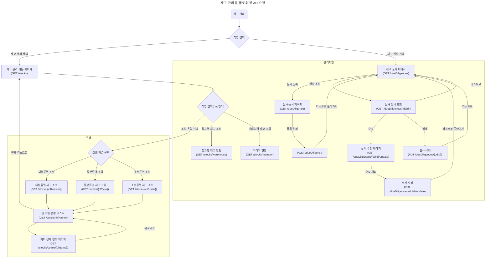

## 재고 관리 웹 API 요청 플로우 차트

### API 요청 설명
사용자가 메인화면의 nav바에서 재고 관리(GET /stocks)와 재고 실사(GET /dueDiligences) 메뉴 중 선택 할 수 있습니다.
재고 실사 메뉴는 관리자 이외의 사용자는 접근 권한이 없게 설정합니다.
1. 재고 조회
- (GET /stocks): 재고 관리 메뉴의 첫 화면인 재고 조회 리스트를 보여줍니다.
- (GET /stocks/{cfRoasted}): 대분류별 조회 선택을 누르고 해당 대분류를 선택하면 key=value를 통해 해당 대분류에 대한 리스트를 요청하여 보여줍니다.
- (GET /stocks/{cfType}): 중분류별 조회 선택을 누르고 해당 중분류를 선택하면 key=value를 통해 해당 중분류에 대한 리스트를 요청하여 보여줍니다.
- (GET /stocks/{cfGrade}): 소분류별 조회 선택을 누르고 해당 소분류를 선택하면 key=value를 통해 해당 소분류에 대한 리스트를 요청하여 보여줍니다.
- (GET /stocks/{cfName}): 전체 리스트에서 해당 재고의 품목명을 클릭하면 폼목에 대한 재고 리스트를 요청하여 보여줍니다.
- (GET /stocks/coffee/{cfName}): 품목별 재고 리스트에서 상세보기 버튼을 누르면 커피에 대한 정보를 요청하여 보여줍니다.
2. 창고 현황 리스트
- (GET /stocks/warehouse): 재고 관리 첫화면의 nav 바에 있는 창고별 재고를 누르면 모든 창고에 대한 전체 재고 개수 리스트를 보여줍니다. 관리자가 아닌 사용자는 접근 권한이 없습니다
3. 거래처 현황 리스트
- (GET /stocks/member): 재고 관리 첫 화면의 nav 바에 있는 거래처 현황을 누르면 거래처 내역을 요청하여 보여줍니다. 관리자가 아닌 사용자는 접근 권한이 없습니다
4. 재고 실사 조회
- (GET /dueDiligences): 재고 실사의 기본 페이지인 재고 실사 리스트를 보여줍니다.
- (GET /dueDiligences/{ddId}): 리스트에서 클릭을 통해 재고 실사 id로 해당 재고 실사를 조회합니다.
5. 재고 실사 등록
- (GET /dueDiligence): 등록 버튼을 누르면 재고 실사 등록 form을 보여줍니다.
- (POST /dueDiligence): 입력하고 form을 제출하면 재고 실사가 등록됩니다.
6. 재고 실사 수정
- (GET /dueDiligences/{ddId}/update): 조회한 재고 실사에 대해 수정 버튼을 누르면 수정 페이지로 이동합니다.
- (PUT /dueDiligences /{ddId}/update): 수정할 부분을 수정한 뒤 버튼을 누르면 재고 실사가 수정됩니다.
7. 재고 실사 삭제
- (PUT /dueDiligences/{ddId}): 삭제 하고 싶은 재고 실사를 조회하여 삭제 버튼을 누르면 삭제합니다.