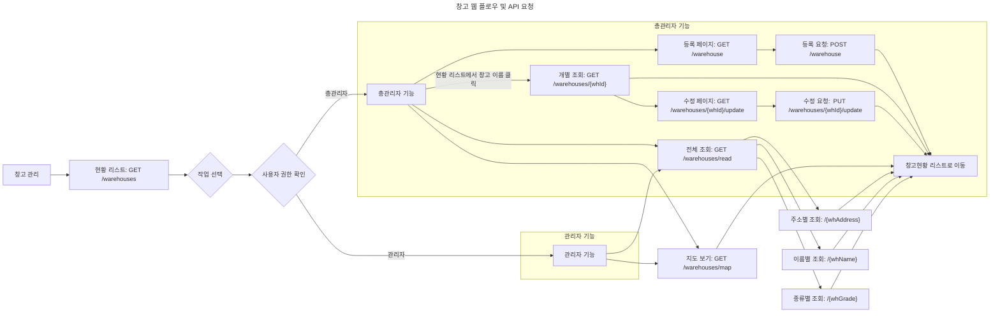

## 창고 관리 웹 API 요청 플로우 차트

### API 요청 설명

관리자가 창고 관리로 접속하면, 현재 창고 현황 리스트가 GET /warehouses로 요청되어 첫 화면으로 보여집니다.

1. 신규 창고 등록
- (GET /warehouse) : 신규 창고를 등록할 수 있는 form 화면을 보여줍니다. 총관리자 이외의 회원에 대해서는 접근 권한이 없음을 알립니다.
- (POST /warehouse): 입력하고 form을 제출하면 해당 창고가 등록됩니다.

2. 창고 개별 조회
- (GET /warehouses/{whId}): 현황 리스트에서 창고 이름을 클릭하면 해당 창고에 대한 자세한 내용을 볼 수 있습니다. 이후 리스트로 돌아가기 버튼을 누르면 첫 화면으로 돌아갑니다.

3. 창고 수정
- (GET /warehouses/{whId}/update): 창고 개별 조회 페이지에서 수정 버튼을 누르면 수정할 수 있는 페이지로 이동합니다.
- (PUT /warehouses/{whId}/update): 수정할 내용을 입력하고 수정하기 버튼을 누르면 수정한 뒤 창고현황 리스트로 돌아갑니다.

4. 창고 조회
- (GET /warehouses/read): 창고 조회 페이지로 들어갑니다. 여러 조회 방식들을 보여주는 기본 페이지입니다.
- (GET /warehouses/read/{whAddress}): 소재지로 창고를 조회합니다. 이후 리스트로 돌아가기 버튼을 누르면 첫 화면으로 돌아갑니다.
- (GET /warehouses/read/{whName}): 창고명으로 창고를 조회합니다. 이후 리스트로 돌아가기 버튼을 누르면 첫 화면으로 돌아갑니다.
- (GET /warehouses/read/{whGrade}): 창고 종류를 선택하여 창고를 조회합니다. 이후 리스트로 돌아가기 버튼을 누르면 첫 화면으로 돌아갑니다.

4. 창고 위치 지도 대치
- (GET /warehouses/map): kakao map을 이용하여 해당 창고의 위치를 보여줍니다.