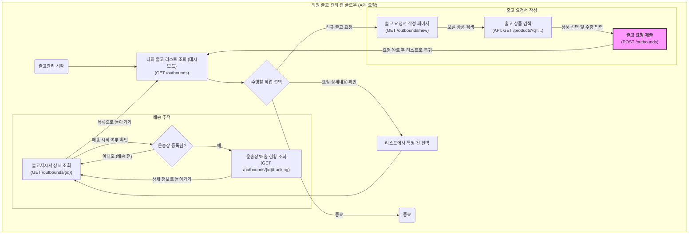
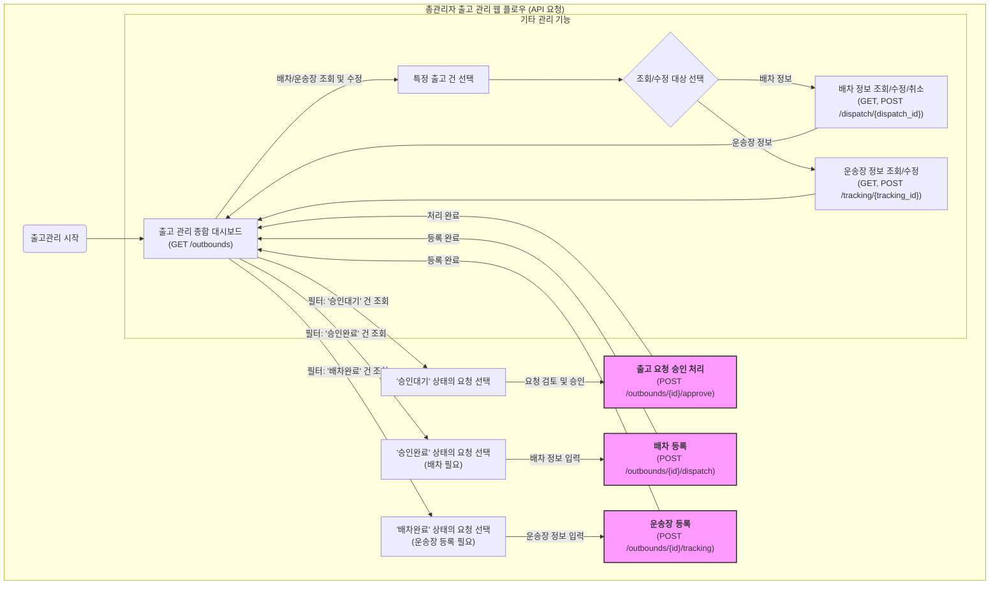

## 회원 출고 관리 웹 API 요청 플로우 차트

### API 요청 설명

1. 출고 리스트 조회 (대시보드)

- (GET /outbounds): 회원이 출고 관리 메뉴에 처음 진입했을 때 보게 되는 페이지입니다. 자신의 모든 출고 요청 목록과 현재 처리 상태(요청, 승인, 배송중 등)를 한눈에 파악할 수 있습니다.

2. 신규 출고 요청

- (GET /outbounds/new): 새로운 출고를 요청하기 위한 작성 페이지를 불러옵니다.
- (API: GET /products?q=...): 요청서 페이지 내에서, 창고에 보관된 자신의 상품 중 출고할 상품을 검색하는 기능입니다.
- (POST /outbounds): 출고할 상품, 수량, 배송지 정보 등을 모두 입력한 뒤 서버로 전송하여 신규 출고를 요청합니다.

3. 출고 진행 상황 조회

- (GET /outbounds/{id}): 출고 리스트에서 특정 건을 선택했을 때, 해당 건에 대한 **상세 정보(출고지시서)**를 조회합니다. 어떤 상품이 몇 개 출고되는지 등의 구체적인 내용을 확인할 수 있습니다.
- (GET /outbounds/{id}/tracking): 관리자가 배송을 시작하고 운송장 번호를 등록했을 경우, 이 API를 통해 실시간 배송 현황을 추적할 수 있습니다.

## 관리자 출고 관리 웹 API 요청 플로우 차트

### API 요청 설명

1. 출고 관리 대시보드 (중심)

- (GET /outbounds): 모든 출고 요청 목록을 보여주는 종합 대시보드입니다. 관리자는 이 곳에서 각 요청의 현재 상태(승인대기, 승인완료, 배차완료, 배송중 등)를 한눈에 파악하고, 상태별 필터링을 통해 처리할 업무를 선택합니다.

2. 1단계: 출고 요청 승인

- 관리자는 대시보드에서 '승인대기' 상태의 요청을 필터링하여 선택합니다.
- (POST /outbounds/{id}/approve): 출고할 상품과 수량, 배송지를 검토한 후, 문제가 없으면 '승인' 처리를 합니다. 처리된 요청은 '승인완료' 상태가 됩니다.

3. 2단계: 배차 등록

- 이제 관리자는 '승인완료' 상태의 요청(출고가 확정되었으나 아직 차량이 배정되지 않은 건)을 선택합니다.
- (POST /outbounds/{id}/dispatch): 해당 출고 건을 운송할 차량과 기사 정보를 입력하여 배차를 등록합니다. 처리된 요청은 '배차완료' 상태가 됩니다.

4. 3단계: 운송장 등록

- '배차완료' 상태의 요청(차량은 배정되었으나 아직 실물이 출고되지 않은 건)을 선택합니다.
- (POST /outbounds/{id}/tracking): 배차된 기사가 상품을 픽업하고 운송이 시작되면, 발급된 운송장 번호를 시스템에 등록합니다. 이 시점부터 회원도 배송 추적이 가능해지며, 요청은 '배송중' 상태로 변경됩니다.

5. 기타 관리 기능

- 이미 등록된 배차 정보나 운송장 정보를 조회, 수정, 취소해야 할 경우를 위한 별도의 관리 흐름을 포함합니다.
- (GET, POST /dispatch/{dispatch_id}): 특정 배차 건에 대한 상세 조회, 수정, 취소 등을 처리합니다.
- (GET, POST /tracking/{tracking_id}): 특정 운송장 정보를 조회하거나 수정합니다.
