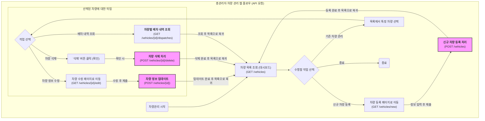

## 관리자 차량 관리 웹 API 요청 플로우 차트

---

### API 요청 설명

1. 차량 목록 조회 (대시보드)

- (GET /vehicles): 관리자가 차량 관리 메뉴에 진입하면 가장 먼저 보게 되는 페이지입니다. 시스템에 등록된 모든 차량의 목록을 조회합니다. 이 페이지가 모든 차량 관리 기능의 시작점입니다.

2. 신규 차량 등록 (Create)

- (GET /vehicles/new): 신규 차량 정보를 입력할 수 있는 등록 페이지(양식)를 불러옵니다.
- (POST /vehicles): 입력된 차량 정보(차량 번호, 차종, 기사 정보 등)를 서버로 전송하여 새로운 차량을 등록합니다.

3. 기존 차량 관리 (Update, Delete, Read History)

- 관리자는 차량 목록에서 특정 차량을 선택하여 아래의 작업들을 수행합니다.
- 수정 (Update)
  - (GET /vehicles/{id}/edit): 선택한 차량({id})의 기존 정보가 채워진 수정 페이지를 불러옵니다.
  - (POST /vehicles/{id}): 수정된 차량 정보를 서버로 전송하여 데이터를 업데이트합니다.
- 삭제 (Delete)
  - (POST /vehicles/{id}/delete): 선택한 차량({id})의 정보를 시스템에서 삭제합니다. (사용자 확인 절차 포함)
- 배차 내역 조회 (Read History)
  - (GET /vehicles/{id}/dispatches): 선택한 차량({id})이 과거에 어떤 출고 건들을 배차받았는지 그 이력 목록을 조회합니다.
